# Trust Registry System Architecture

## 📐 System Overview

This document describes the complete architecture of the Trust Registry system, from backend services to frontend dashboard and wallet integration.

## 🏗️ High-Level Architecture


## 📊 Detailed Architecture Layers

### Layer 1: Wallet & Client Applications


**Responsibilities**:
- Store and manage verifiable credentials
- Query trust registry for issuer/verifier authorization
- Cache registry metadata for offline validation
- Verify credential signatures and status


**Key Features**:
- TRQP v2 protocol support
- Service discovery via metadata endpoint
- Automatic endpoint configuration
- Trust decision caching

---

### Layer 2: Frontend Dashboard (SvelteKit)


**Technology Stack**:
- **Framework**: SvelteKit
- **UI Library**: Tailwind CSS + shadcn-svelte
- **State Management**: Svelte stores
- **API Communication**: Fetch API with TypeScript

**Key Features**:
- Registry management interface
- Issuer/Verifier registration
- Credential schema management
- Audit log viewer
- Real-time statistics dashboard


---

### Layer 3: Backend API (Express.js + TypeScript)


**Technology Stack**:
- **Runtime**: Node.js 20 LTS
- **Framework**: Express.js 4.x
- **Language**: TypeScript 5.x
- **ORM**: Prisma 5.x
- **Database**: PostgreSQL 15
- **Cache**: Redis 7
- **Validation**: AJV (JSON Schema)
- **Testing**: Jest


**API Endpoints Structure**:

```mermaid
graph LR
    subgraph "Public Endpoints (No Auth)"
        PE1[/v2/public/registries]
        PE2[/v2/public/issuers]
        PE3[/v2/public/verifiers]
        PE4[/v2/public/lookup/issuer/:did]
        PE5[/v2/authorization]
        PE6[/v2/recognition]
        PE7[/v2/metadata]
    end
    
    subgraph "Protected Endpoints (Auth Required)"
        PR1[/v2/registries]
        PR2[/v2/issuers]
        PR3[/v2/verifiers]
        PR4[/v2/schemas]
        PR5[/v2/api-keys]
        PR6[/v2/audit-log]
    end
    
    style PE5 fill:#4CAF50
    style PE6 fill:#4CAF50
    style PE7 fill:#4CAF50
    style PR5 fill:#F44336
```

---

### Layer 4: Data Layer


**Database Schema Highlights**:
- **Trust Frameworks**: Governance frameworks (10 frameworks)
- **Trust Registries**: Registry instances (45 registries globally)
- **Credential Schemas**: Credential type definitions (8 types)
- **Issuers**: Authorized credential issuers
- **Verifiers**: Authorized credential verifiers
- **Registry Recognitions**: Inter-registry trust relationships
- **Audit Logs**: Complete audit trail
- **API Keys**: Authentication with RBAC

---

## 🔄 Data Flow Diagrams

### Authorization Query Flow


### Recognition Query Flow


### Credential Issuance & Verification Flow

```mermaid
sequenceDiagram
    participant H as Holder (Wallet)
    participant I as Issuer
    participant TR as Trust Registry
    participant V as Verifier
    
    Note over H,V: 1. Credential Issuance
    H->>I: Request credential
    I->>TR: Check if authorized to issue
    TR-->>I: Authorized ✓
    I->>H: Issue signed credential
    
    Note over H,V: 2. Credential Presentation
    V->>H: Request credential presentation
    H->>TR: Check if verifier is trusted
    TR-->>H: Verifier trusted ✓
    H->>V: Present credential
    
    Note over H,V: 3. Credential Verification
    V->>TR: Check if issuer is authorized
    TR-->>V: Issuer authorized ✓
    V->>I: Check credential status (optional)
    I-->>V: Status: Valid ✓
    V->>V: Verify signature
    V-->>H: Verification result
```



### Service Discovery Flow (Metadata)


---

## 🌐 Federation & Inter-Registry Trust


**Recognition Types**:
- **Bilateral**: Mutual recognition between two registries
- **Unilateral**: One-way recognition
- **Multilateral**: Multiple registries recognize each other
- **Hierarchical**: Parent registry recognizes child registries

---

## 🔐 Security Architecture


**Security Features**:
- **API Key Authentication**: HMAC-based with bcrypt hashing
- **Role-Based Access Control**: 3 roles (admin, registry_owner, public)
- **Rate Limiting**: 60 requests/minute for public endpoints
- **Audit Logging**: Complete audit trail of all operations
- **DID Verification**: Cryptographic verification of DIDs
- **Signature Verification**: Ed25519 signatures for registry entries

---

## 📱 Wallet Integration Architecture


**Wallet Integration Steps**:

1. **Service Discovery**
   ```typescript
   const metadata = await fetch('https://registry.example.com/v2/metadata')
   // Auto-configure endpoints
   ```

2. **Trust Validation**
   ```typescript
   const result = await trustRegistry.checkAuthorization(
     issuerDid, registryDid, 'issue', 'UniversityDegree'
   )
   ```

3. **Credential Storage**
   - Store credentials in secure storage
   - Cache issuer/verifier trust status
   - Maintain offline capability


---

## 🚀 Deployment Architecture


**Deployment Options**:
- **Docker Compose**: Development & testing
- **Kubernetes**: Production deployment
- **Cloud Platforms**: AWS, Azure, GCP
- **On-Premise**: Self-hosted infrastructure

---

## 📊 Technology Stack Summary

### Backend
| Component | Technology | Version |
|-----------|-----------|---------|
| Runtime | Node.js | 20 LTS |
| Framework | Express.js | 4.x |
| Language | TypeScript | 5.x |
| ORM | Prisma | 5.x |
| Database | PostgreSQL | 15+ |
| Cache | Redis | 7+ |
| Testing | Jest | 29.x |
| Validation | AJV | 8.x |
| Documentation | Swagger/OpenAPI | 3.0 |

### Frontend
| Component | Technology | Version |
|-----------|-----------|---------|
| Framework | SvelteKit | Latest |
| Language | TypeScript | 5.x |
| Styling | Tailwind CSS | 3.x |
| UI Components | shadcn-svelte | Latest |
| State | Svelte Stores | Built-in |
| Build Tool | Vite | Latest |


### Standards & Protocols
| Standard | Version | Purpose |
|----------|---------|---------|
| TRQP | v2.0 | Trust Registry Query Protocol |
| W3C DID | 1.0 | Decentralized Identifiers |
| W3C VC | 1.1 | Verifiable Credentials |
| OpenAPI | 3.0 | API Documentation |
| JSON Schema | Draft-07 | Data Validation |
| RFC 7807 | - | Problem Details |
| RFC 3339 | - | Date/Time Format |

---

## 🔄 System Integration Points


**Integration Protocols**:
- **TRQP v2**: Authorization & Recognition queries
- **REST API**: Management operations
- **DID Resolution**: Universal Resolver compatible
- **Federation**: Inter-registry trust queries

---

## 📈 Scalability Considerations

### Horizontal Scaling


**Scalability Features**:
- Stateless API design
- Database connection pooling
- Redis caching for hot data
- CDN for static assets
- Read replicas for database
- Horizontal pod autoscaling (K8s)


---

## 🔍 Monitoring & Observability


**Key Metrics**:
- Request rate & latency
- Error rates by endpoint
- Database query performance
- Cache hit/miss ratio
- DID resolution time
- Active connections

---

## 🎯 Performance Targets

| Metric | Target | Notes |
|--------|--------|-------|
| API Response Time | < 100ms | P95 for cached queries |
| Authorization Query | < 200ms | P95 including DB lookup |
| Recognition Query | < 300ms | P95 including federation |
| Metadata Endpoint | < 50ms | Cached response |
| DID Resolution | < 500ms | Including network calls |
| Database Queries | < 50ms | P95 for indexed queries |
| Throughput | 1000 req/s | Per API instance |
| Availability | 99.9% | 3 nines SLA |

---

## 📚 Documentation Structure

```
trust-registry/
├── ARCHITECTURE.md (this file)
├── backend/
│   ├── README.md
│   ├── docs/
│   │   ├── API-GUIDE.md
│   │   ├── PUBLIC-API.md
│   │   ├── METADATA-ENDPOINT.md
│   │   ├── TRQP-API.md
│   │   ├── AUTHENTICATION.md
│   │   └── Diagrams/
│   │       ├── 01-ecosystem-overview.md
│   │       ├── 02-credential-flow.md
│   │       └── 03-wallet-integration-flow.md
│   ├── IMPLEMENTATION-COMPLETE.md
│   └── TODO.md
├── frontend/
│   ├── README.md
│   └── docs/
│       ├── 01-dashboard.md
│       └── Tutorial/
│           └── 01-getting-started.md
└── DEPLOYMENT.md
```

---

## 🚦 Getting Started

### For Developers

1. **Backend Setup**
   ```bash
   cd backend
   npm install
   cp .env.example .env
   npm run prisma:generate
   npm run prisma:migrate
   npm run dev
   ```

2. **Frontend Setup**
   ```bash
   cd frontend
   npm install
   cp .env.example .env
   npm run dev
   ```

3. **Access Points**
   - Backend API: http://localhost:3000
   - API Docs: http://localhost:3000/api-docs
   - Frontend: http://localhost:5173


### For Wallet Developers

1. **Service Discovery**
   ```bash
   curl https://registry.example.com/v2/metadata
   ```

2. **Authorization Check**
   ```bash
   curl -X POST https://registry.example.com/v2/authorization \
     -H "Content-Type: application/json" \
     -d '{
       "entity_id": "did:web:university.edu",
       "authority_id": "did:web:registry.example.com",
       "action": "issue",
       "resource": "UniversityDegree"
     }'
   ```

3. **Integration Examples**
   - See: `backend/docs/examples/metadata-client-examples.md`
   - Languages: TypeScript, Python, Java, Go, Rust, cURL

---

## 🔐 Security Best Practices

### For Operators

1. **API Keys**
   - Rotate keys regularly (every 90 days)
   - Use strong random generation
   - Store securely (never in code)
   - Monitor usage patterns

2. **Database**
   - Enable encryption at rest
   - Use SSL/TLS for connections
   - Regular backups (daily)
   - Test restore procedures

3. **Network**
   - Use HTTPS only (TLS 1.3)
   - Configure firewall rules
   - Enable DDoS protection
   - Monitor traffic patterns

4. **Monitoring**
   - Set up alerts for anomalies
   - Review audit logs regularly
   - Track failed authentication attempts
   - Monitor resource usage

---

## 🌟 Key Features Summary

### TRQP v2 Compliance
- ✅ Authorization queries
- ✅ Recognition queries
- ✅ Metadata endpoint
- ✅ HTTPS binding
- ✅ JSON Schema validation
- ✅ RFC 7807 error handling

### Global Coverage
- ✅ 45 trust registries
- ✅ 10 trust frameworks
- ✅ 6 continents covered
- ✅ Indonesia included (🇮🇩)
- ✅ Inter-registry recognitions

### Developer Experience
- ✅ OpenAPI/Swagger docs
- ✅ Multi-language examples
- ✅ Service discovery
- ✅ Auto-configuration
- ✅ Comprehensive testing

### Production Ready
- ✅ Docker support
- ✅ Kubernetes ready
- ✅ Monitoring & logging
- ✅ Security hardened
- ✅ Scalable architecture

---

## 📞 Support & Resources

### Documentation
- **Backend API**: `/backend/docs/`
- **Frontend**: `/frontend/docs/`
- **TRQP Spec**: https://trustoverip.github.io/tswg-trust-registry-protocol/
- **W3C DID**: https://www.w3.org/TR/did-core/
- **W3C VC**: https://www.w3.org/TR/vc-data-model/

### Community
- **GitHub**: https://github.com/kodratIT/backend-trust-registry
- **Issues**: Report bugs and feature requests
- **Discussions**: Ask questions and share ideas

---

**Version**: 2.0.0  
**Last Updated**: 2024-12-01  
**Status**: ✅ Production Ready

