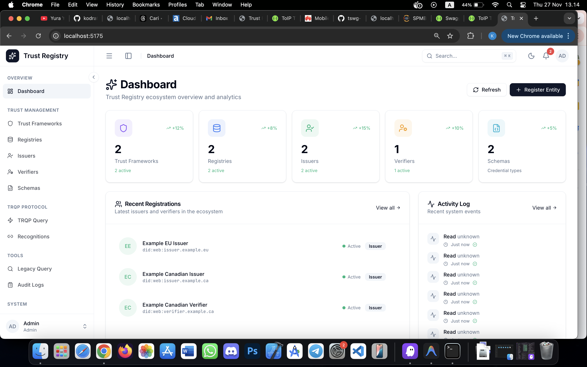
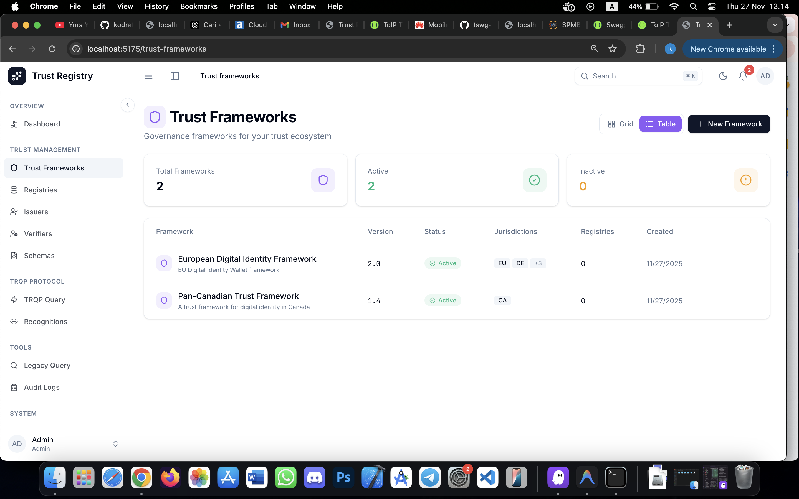
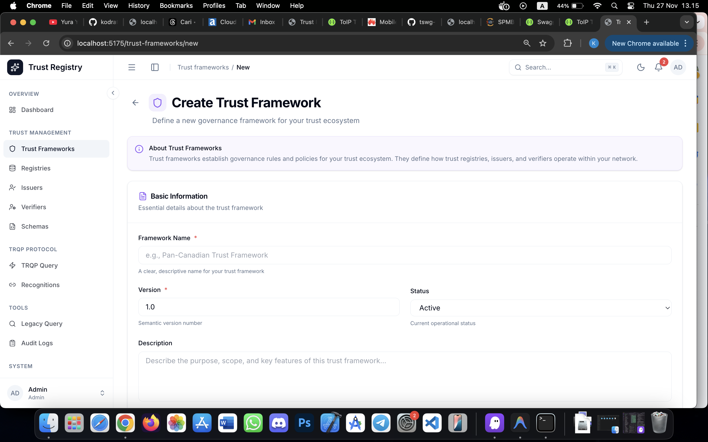
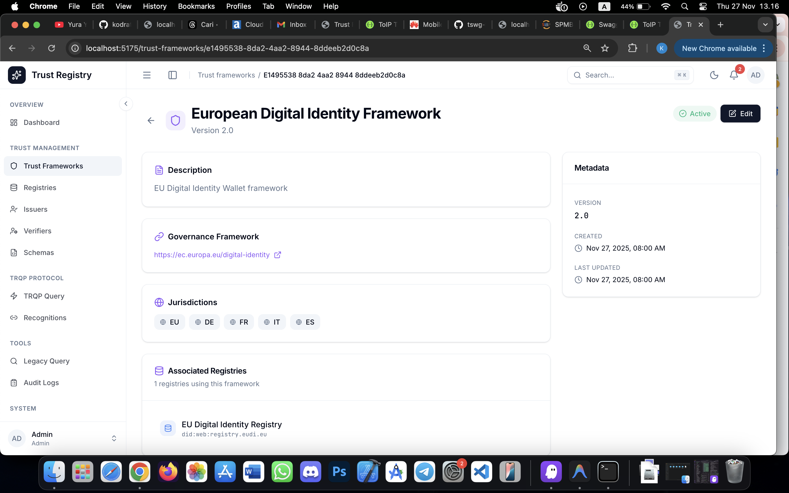
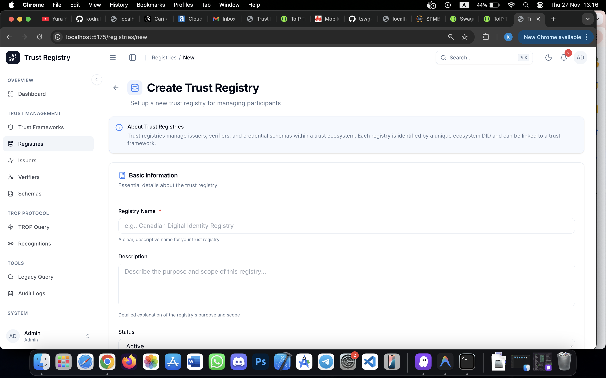
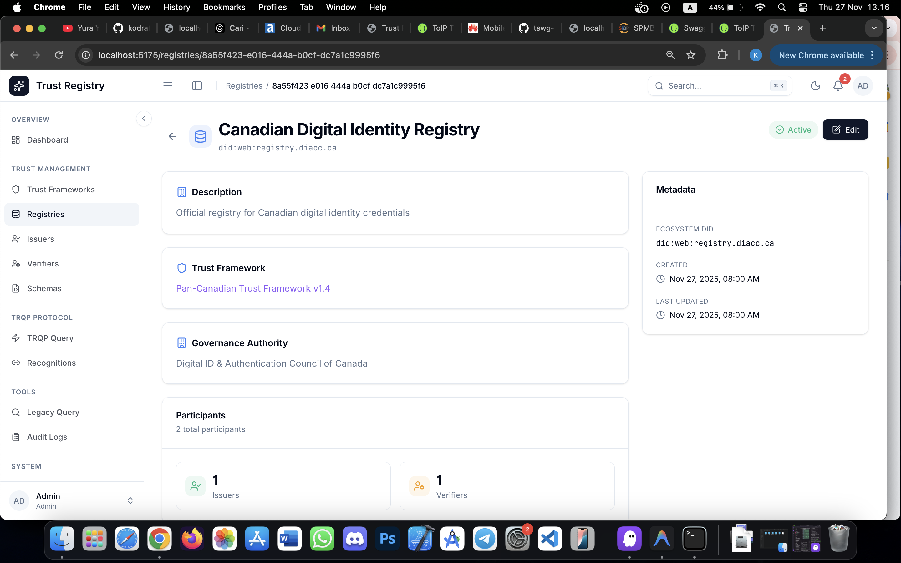
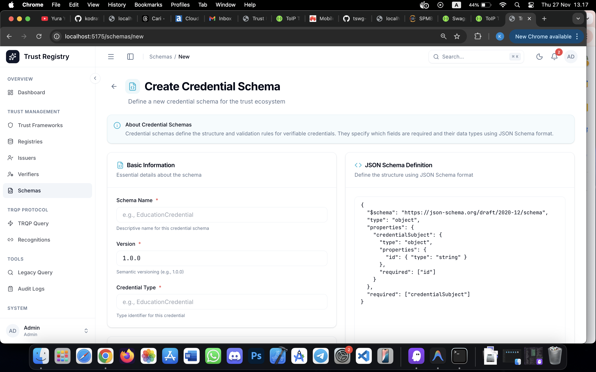
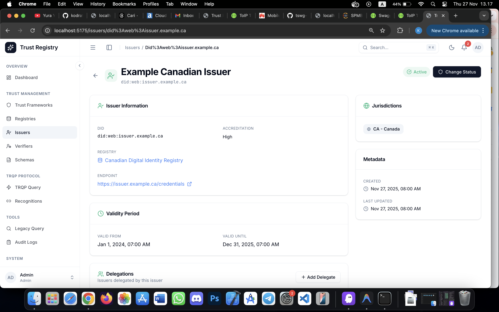
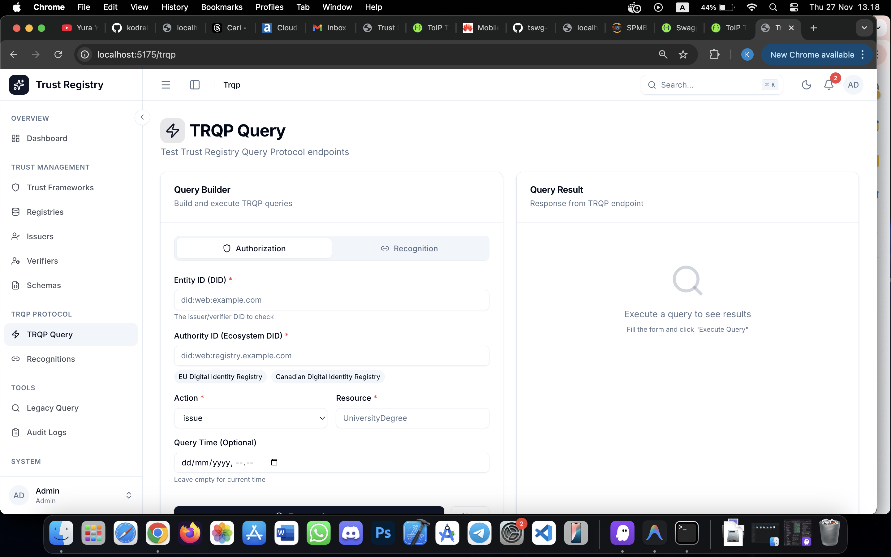

# Tutorial: Memulai Trust Registry

Panduan langkah demi langkah untuk admin yang baru pertama kali menggunakan Trust Registry.

## Prasyarat

Sebelum memulai, pastikan:
- ✅ Backend server sudah berjalan (`npm run dev` di folder backend)
- ✅ Frontend sudah berjalan (`npm run dev` di folder frontend)
- ✅ Database sudah di-setup (`npx prisma migrate dev`)
- ✅ Anda memiliki API Key dengan role `admin`

---

## Langkah 1: Login ke Sistem

1. Buka browser dan akses `http://localhost:5173`
2. Anda akan diarahkan ke halaman login
3. Masukkan API Key Anda
4. Klik tombol **Sign In**

<!-- Screenshot: Halaman Login -->


> 💡 **Tips**: Jika belum punya API Key, minta ke administrator atau buat melalui database seed.

---

## Langkah 2: Kenali Dashboard

Setelah login, Anda akan melihat Dashboard dengan:
- **Statistik Cards**: Jumlah Trust Frameworks, Registries, Issuers, dll
- **Recent Activity**: Log aktivitas terbaru

<!-- Screenshot: Dashboard -->


---

## Langkah 3: Buat Trust Framework Pertama

Trust Framework adalah level tertinggi dalam hierarki. Buat ini dulu sebelum yang lain.

### 3.1 Buka Menu Trust Frameworks
1. Klik menu **Trust Frameworks** di sidebar kiri

<!-- Screenshot: Menu Trust Frameworks -->


### 3.2 Klik Create New
1. Klik tombol **+ Create New** di pojok kanan atas

<!-- Screenshot: Tombol Create -->


### 3.3 Isi Form
Isi data Trust Framework:

| Field | Contoh | Keterangan |
|-------|--------|------------|
| Name | `National Identity Framework` | Nama framework |
| Description | `Framework untuk identitas digital nasional` | Deskripsi |
| Governance URL | `https://gov.example.com/framework` | Link dokumen governance |
| Version | `1.0.0` | Versi (format: x.y.z) |
| Status | `Active` | Status framework |

<!-- Screenshot: Form Trust Framework -->


### 3.4 Simpan
1. Klik tombol **Save** atau **Create**
2. Anda akan diarahkan ke halaman detail

<!-- Screenshot: Detail Trust Framework -->


✅ **Selesai!** Trust Framework pertama Anda sudah dibuat.

---

## Langkah 4: Buat Registry

Registry adalah tempat mendaftarkan Issuers dan Verifiers.

### 4.1 Buka Menu Registries
1. Klik menu **Registries** di sidebar

### 4.2 Klik Create New
1. Klik tombol **+ Create New**

### 4.3 Isi Form
Isi data Registry:

| Field | Contoh | Keterangan |
|-------|--------|------------|
| Name | `Education Registry` | Nama registry |
| Ecosystem DID | `did:web:edu-registry.example.com` | DID unik untuk registry |
| Description | `Registry untuk institusi pendidikan` | Deskripsi |
| Endpoint | `https://api.edu-registry.example.com` | URL API (opsional) |
| Trust Framework | `National Identity Framework` | Pilih framework yang sudah dibuat |
| Status | `Active` | Status registry |

<!-- Screenshot: Form Registry -->


### 4.4 Simpan
1. Klik **Save**
2. Registry berhasil dibuat

<!-- Screenshot: Detail Registry -->


---

## Langkah 5: Buat Schema

Schema mendefinisikan jenis credential yang bisa diterbitkan.

### 5.1 Buka Menu Schemas
1. Klik menu **Schemas** di sidebar

### 5.2 Klik Create New
1. Klik tombol **+ Create New**

### 5.3 Isi Form

| Field | Contoh | Keterangan |
|-------|--------|------------|
| Name | `University Degree` | Nama schema |
| Type | `UniversityDegree` | Identifier (tanpa spasi) |
| Version | `1.0.0` | Versi schema |
| Registry | `Education Registry` | Pilih registry |
| Schema URL | `https://schema.org/UniversityDegree` | Link ke JSON Schema (opsional) |
| Issuer Mode | `Shared` | `Exclusive` = 1 issuer, `Shared` = banyak issuer |
| Status | `Active` | Status schema |

<!-- Screenshot: Form Schema -->


### 5.4 Simpan
1. Klik **Save**

---

## Langkah 6: Daftarkan Issuer

Issuer adalah entitas yang menerbitkan credential.

### 6.1 Buka Menu Issuers
1. Klik menu **Issuers** di sidebar

### 6.2 Klik Register New
1. Klik tombol **+ Register New**

### 6.3 Isi Form

| Field | Contoh | Keterangan |
|-------|--------|------------|
| DID | `did:web:university-abc.edu` | DID unik issuer |
| Name | `University ABC` | Nama issuer |
| Registry | `Education Registry` | Pilih registry |
| Endpoint | `https://api.university-abc.edu` | URL API (opsional) |
| Accreditation | `Advanced` | Level akreditasi |
| Valid From | `2024-01-01` | Tanggal mulai berlaku |
| Valid Until | `2025-12-31` | Tanggal berakhir |
| Status | `Active` | Status issuer |

<!-- Screenshot: Form Issuer -->


### 6.4 Pilih Credential Schemas
1. Di bagian **Credential Schemas**, centang schema yang boleh diterbitkan
2. Contoh: centang `UniversityDegree`

### 6.5 Simpan
1. Klik **Save**

<!-- Screenshot: Detail Issuer -->


---

## Langkah 7: Daftarkan Verifier

Verifier adalah entitas yang memverifikasi credential.

### 7.1 Buka Menu Verifiers
1. Klik menu **Verifiers** di sidebar

### 7.2 Klik Register New
1. Klik tombol **+ Register New**

### 7.3 Isi Form

| Field | Contoh | Keterangan |
|-------|--------|------------|
| DID | `did:web:hr-platform.example.com` | DID unik verifier |
| Name | `HR Platform` | Nama verifier |
| Registry | `Education Registry` | Pilih registry |
| Status | `Active` | Status verifier |

### 7.4 Pilih Credential Schemas
1. Centang schema yang boleh diverifikasi

### 7.5 Simpan
1. Klik **Save**

---

## Langkah 8: Test dengan TRQP Query

Sekarang test apakah setup sudah benar.

### 8.1 Buka Menu TRQP Query
1. Klik menu **TRQP Query** di sidebar

### 8.2 Test Authorization Query
1. Pilih tab **Authorization**
2. Isi form:

| Field | Value |
|-------|-------|
| Entity ID | `did:web:university-abc.edu` |
| Authority ID | `did:web:edu-registry.example.com` |
| Action | `issue` |
| Resource | `UniversityDegree` |

3. Klik **Execute Query**

<!-- Screenshot: TRQP Query -->


### 8.3 Lihat Hasil
Jika setup benar, hasilnya:
```
✓ AUTHORIZED
Entity is authorized for this action
```

<!-- Screenshot: TRQP Result -->


---

## Selesai! 🎉

Anda telah berhasil:
- ✅ Login ke sistem
- ✅ Membuat Trust Framework
- ✅ Membuat Registry
- ✅ Membuat Schema
- ✅ Mendaftarkan Issuer
- ✅ Mendaftarkan Verifier
- ✅ Test TRQP Query

## Langkah Selanjutnya

- 📖 [Tutorial: Mengelola Recognitions](./02-managing-recognitions.md)
- 📖 [Tutorial: Delegasi Issuer](./03-issuer-delegation.md)
- 📖 [Tutorial: Mengelola API Keys](./04-managing-api-keys.md)

---

## Troubleshooting

### Query mengembalikan "Not Authorized"
- Pastikan status Issuer = `Active`
- Pastikan status Registry = `Active`
- Pastikan Issuer memiliki schema yang di-query
- Pastikan validity period masih berlaku

### Tidak bisa login
- Pastikan API Key benar
- Pastikan backend server berjalan
- Cek console browser untuk error

### Data tidak muncul
- Refresh halaman
- Cek koneksi ke backend
- Pastikan database sudah di-migrate
